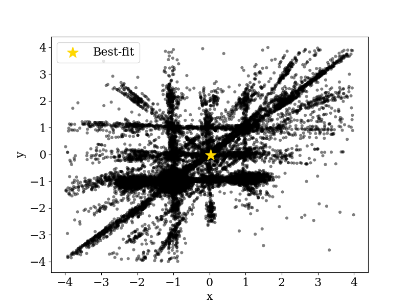
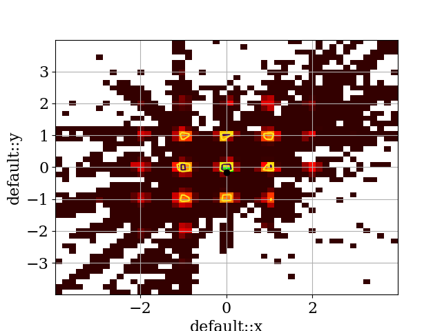

.. _quick start:

Quick Start
============

Import the module::

    import pyscannerbit.scan as sb

    # And some other stuff for use in this example
    import numpy as np
    import math
    import matplotlib.pyplot as plt

Define the function to be scanned. Make sure the first argument is called :code:`scan`, as a reference to a special interface object will be passed into this argument. The rest of the arguments should be the parameters you wish to scan::

    # Test function
    def rastrigin(scan,x,y,z):
        X = [x,y,z]
        A = 10
        scan.print("x+y+z",x+y+x) # Send extra results to output file.
        return - (A + sum([(x**2 - A * np.cos(2 * math.pi * x)) for x in X]))

Internally, scans are conducted inside a unit hypercube with a uniform prior weighting. This needs to be "stretched" into the parameter space you want to scan via a "prior transformation" function, in a fashion analogous to inverse transform sampling. Below a simple uniform prior over the range [-4,4] is defined for each parameter::

    # Prior transformation from unit hypercube
    def prior(vec, map):
        map["x"] = -4 + 8*vec[0] # flat prior over [-4,4]
        map["y"] = -4 + 8*vec[1]
        map["z"] = -4 + 8*vec[2]

Here :code:`vec` will contain a sample from the unit hypercube (the input of the transform) at each iteration of the scan, and :code:`map` should be filled with the transformed parameter values, which will in turn be passed on to the matching arguments of the target function.

Next, set some options for your preferred scanning algorithm, to be passed as a dictionary::

    twalk_options = {"sqrtR": 1.05}

Now create and run your scan!::

    myscan = sb.Scan(rastrigin, prior_func=prior, scanner="twalk", scanner_options=twalk_options)
    myscan.scan()
 
By default results will be output to a HDF5 file called :file:`results.hdf5`, located in the directory :file:`pyscannerbit_run_data/samples` relative to where you launched your driver script. Analyse these with whatever tools you like! You will probably need at least the :code:`h5py` package to read the data back into numpy arrays for analysis.

If you just want to plot something quickly, we provide a few small helper tools to retrieve results and make simple plots. For example for a simple scatter plot::

    results = myscan.get_hdf5()
    results.make_plot("x", "y") # Simple scatter plot of samples

   Simple 2D scatter plot of 3D T-Walk scan results.

Or for a binned profile likelihood plot with 68%/95% asympotic confidence regions::

    fig = plt.figure()
    ax = fig.add_subplot(111)
    results.plot_profile_likelihood(ax,"x","y") # Profile likelihood
    fig.savefig("x_y_prof_like.png")

      
   Profile likelihood plot of rastrigin test function, scanned quickly by Twalk

